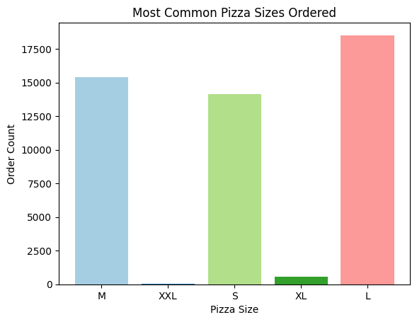
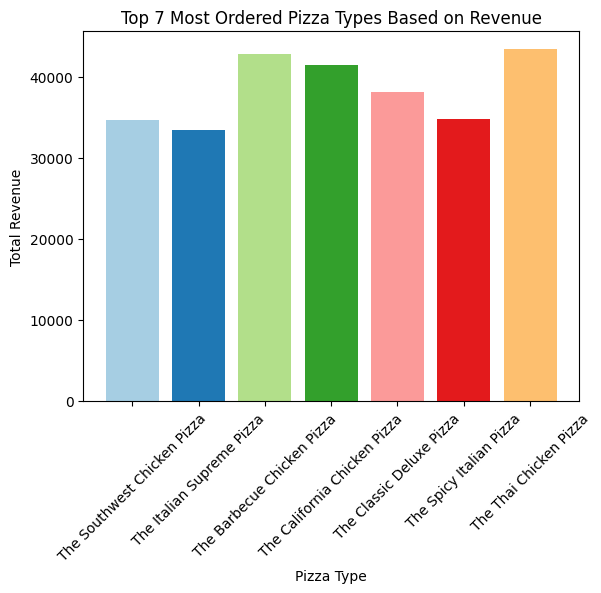
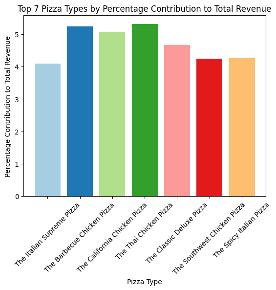

# Pizza Sales Analysis Using SQL and Python Libraries

This project provides an analysis of pizza sales using data from various CSV files including `pizza.csv`, `pizza_type.csv`, `orders.csv`, and `order_details.csv`. The analysis includes SQL queries and Python code to derive insights from the data.

## Project Structure
Each files are present in Data folder. 

- `pizza.csv`: Contains information about pizzas including their size and price.
  - **pizza_id**: Differentiates between small, medium, or large pizzas. Example: Barbieque chicken: `bbq_ckn_s` = small, `bbq_ckn_m` = medium, `bbq_ckn_l` = large
  - **pizza_type_id**: Type of pizza.
  - **size**: Pizza size - Small, Medium, Large.
  - **price**: Pizza price of each size.

- `pizza_type.csv`: Contains information about different pizza types.
  - **pizza_type_id**: Pizza ID.
  - **name**: Pizza name.
  - **category**: Veg or Non-Veg.
  - **ingredients**: Items used to make the pizza.

- `orders.csv`: Contains order details.
  - **order_id**: Order ID.
  - **order_date**: Order date.
  - **order_time**: Order time.

- `order_details.csv`: Contains details of each order.
  - **order_details_id**: Total order details.
  - **order_id**: Same people may have ordered multiple pizzas.
  - **pizza_id**: Which pizza was ordered.
  - **quantity**: Pizza quantity.

## Objectives
Included all the queries solved in **Queries_Solved.txt**

1. Retrieve the total number of orders placed.
2. Calculate the total revenue generated from pizza sales.
3. Identify the highest-priced pizza.
4. Identify the most common pizza size ordered.
5. List the top 5 most ordered pizza types along with their quantities.
6. Calculate the percentage contribution of each pizza type to total revenue.
7. Analyze the cumulative revenue generated over time.
8. Determine the top 3 most ordered pizza types based on revenue for each pizza category.

## Setup

### Prerequisites

- Python 3.9
- pandas
- sqlite3
- matplotlib

## Usage

1. Load the data from the CSV files and create the SQLite database tables.
2. Insert the data into the tables.
3. Run the SQL queries and Python code to generate the required analysis.
4. Plot the results using Matplotlib.

## Result Analysis ##

This section provides an analysis of the key findings from the pizza sales data.

Most Common Pizza Size Ordered: 
The analysis reveals that the most common pizza size ordered is L , with a total order count of 18526.

Top 7 Most Ordered Pizzas Based on Revenue: 
The top 7 most ordered pizzas based on revenue are listed in the chart below. These pizzas contribute significantly to the overall sales revenue.

Top 7 Pizza Types by Percentage Contribution to Total Revenue
The chart below illustrates the top 7 pizza types by their percentage contribution to the total revenue. This analysis helps in understanding which pizza types are driving the most revenue.

## Contributing ##
Contributions are welcome! Please fork this repository, create a new branch, and submit a pull request.

**THANK YOU !!**